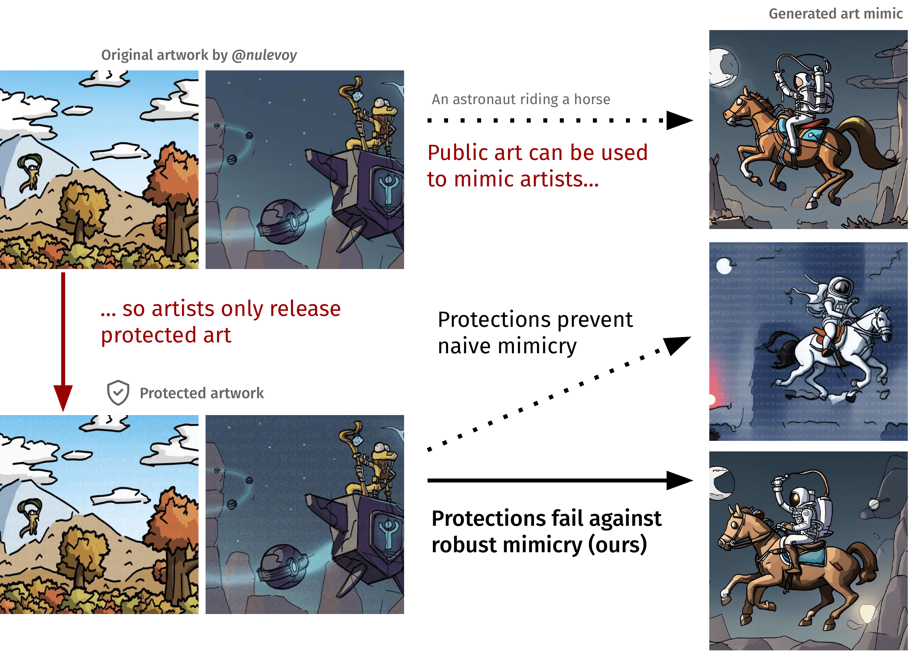

# Adversarial Perturbations Cannot Reliably Protect Artists From Generative AI

[Robert Hönig](https://github.com/roberthoenig)<sup>1</sup>, [Javier Rando](https://javirando.com/)<sup>1</sup>, [Nicholas Carlini](https://nicholas.carlini.com)<sup>2</sup>, [Florian Tramèr](https://floriantramer.com/)<sup>1</sup> | <sup>1</sup>SPY Lab (ETH Zurich) and <sup>2</sup>Google Deepmind.

Official repository for the paper [**Adversarial Perturbations Cannot Reliably Protect Artists From Generative AI**](http://arxiv.org/abs/2406.12027).



You can use this repository to reproduce the experiments
in the paper on your own images. To do this, follow these steps:

1. Have your images ready (or use the training images provided below in [Data](#data)).
1. Verify that your images and your system satisfy the requirements in [Requirements](#requirements).
1. Follow the instructions in [Setup](#setup) to set up your environment.
1. Caption your imags as described in [Captioning](#captioning).
1. If your images are not protected already, apply one of the protections in [Protections](#protections).
1. Process your protected images with one of the methods in [Robust Mimicry Methods](#robust-mimicry-methods).
1. Train Stable Diffusion 2.1 on your processed images as described in [Finetuning](#finetuning).
1. Follow the steps in [Image generation](#image-generation) to generate images.

[Data](#data) links to the images that we process and generate in our paper with these steps.

[Examples](#examples) shows how to apply these steps for training images in our dataset.

## Data

We are releasing the dataset used to train our models and the generated images included in the user study. The dataset only contains data from historical artists. You can access the entire dataset at: https://drive.google.com/file/d/11u6ITxkrAvWLYnry__9rm1QIOQbSKasT. The dataset is organized as follows:

* `training_images`: contains the images used to train our models
    * `original`: original artwork from historical artists, as exported from WikiArt
    * `protected`: contains folders for each protection method (`antidb`, `mist`, `glaze`), with the original artwork after applying the perturbations
    * `protected+preprocessed`: contains the same images as `protected`, but with 3 robust mimicry methods applied for each protection (`diffpure`, `noisy_upscaling`, `impress++`). Note: Impress++ only includes gaussian noising and reverse optimization preprocessing steps, as the remaining steps are applied during sampling.
* `generated_images`: contains the generated images for the evaluation prompts. There is one folder for each protection, with subfolders for each robust mimicry method. The `no-protections` folder contains images generated from models finetuned directly on the original artwork, using the same structure as `generated_images` (folders for each protection and robust mimicry method) to match the different seeds used for each combination. The `naive-mimicry` folder contains generations from models finetuned directly on protected images without any robust mimicry method.

## Requirements

We verified our code for the requirements below. Different configurations may or may not work.

* __Images__: You should have 18 images in the same style. Each image should be a PNG file with dimensions 512 x 512.
* __Operating system__: Ubuntu 20.04
* __GPU__: NVIDIA RTX A6000, 48GB
* __CPU__: AMD EPYC 7742 64-Core Processor
* __Python__: Python 3.11

### Glaze

Glaze is only available on Windows and macOS. We ran Glaze on a Windows VM on Google Cloud Compute with 16 vCPUs and a T4 GPU.

## Setup

Clone `diffusers` and create the virtual environment `robustmimicry`:
```shell
python -m venv robustmimicry
source robustmimicry/bin/activate

# This fork contains two very small modifications to the
# text_to_image finetuning script and the upscaling pipeline.
git clone https://github.com/roberthoenig/diffusers
mv diffusers diffusers_repo
cd diffusers_repo
pip install -e .
cd examples/text_to_image
pip install -r requirements.txt
cd ../../..
pip install -r additional_requirements.txt
```

## Protections

### Glaze

Go to https://glaze.cs.uchicago.edu/downloads.html, download the Glaze app and apply it to your images. We have tested robust mimicry extensively against Glaze 1.1.1, and preliminarily against Glaze 2.0.

### Mist

Clone https://github.com/roberthoenig/mist. This repository forks https://github.com/psyker-team/mist and adds
support for protection against Stable Diffusion 2.1.
Set up the `mist` repository with these instructions:
```shell
cd mist
conda env create -f environments.yml
conda activate mist
pip install --force-reinstall pillow
pip install open_clip_torch
mkdir -p  models/ldm/stable-diffusion-v2
cd models/ldm/stable-diffusion-v2
wget https://huggingface.co/stabilityai/stable-diffusion-2-1/resolve/main/v2-1_768-nonema-pruned.ckpt
mv v2-1_768-nonema-pruned.ckpt model.ckpt
```   
Then, inside `mist`, run the following command to protect your images:

```shell
python mist_v3.py -inp <TRAIN_IMGS> --output_dir <OUTPUT_DIR> --epsilon=7 --steps=100 --mode 1
```

### Mist 2.1

We have tested robust mimicry preliminarily against Mist 2.1. To reproduce our results, go to https://github.com/psyker-team/mist-v2
and follow the instructions to run the Mist-v2 Colab Notebook.

### Anti-DreamBooth

Reproduction instructions coming soon!

## Captioning 

```shell
python caption.py --in_dir '<PROTECTED_TRAIN_IMGS>' --out_dir '<CAPTIONED_PROTECTED_TRAIN_IMGS>'
```

## Robust Mimicry Methods

### Noisy Upscaling

```shell
python noise.py --in_dir '<CAPTIONED_PROTECTED_TRAIN_IMGS>' --out_dir '<PROCESSED_CAPTIONED_PROTECTED_TRAIN_IMGS>'
python upscale.py --in_dir '<PROCESSED_CAPTIONED_PROTECTED_TRAIN_IMGS>' --out_dir '<PROCESSED_CAPTIONED_PROTECTED_TRAIN_IMGS>'
```

### Gaussian Noising

```shell
python noise.py --in_dir '<CAPTIONED_PROTECTED_TRAIN_IMGS>' --out_dir '<PROCESSED_CAPTIONED_PROTECTED_TRAIN_IMGS>'  --gaussian_noise 0.05
```

### DiffPure

Reproduction instructions coming soon!

### IMPRESS++

Reproduction instructions coming soon!

## Finetuning

```shell
python finetune.py --in_dir '<PROCESSED_PROTECTED_TRAIN_IMGS>' --out_dir '<MODEL_DIR>'
```

## Image generation

```shell
python generate.py --in_dir '<MODEL_DIR>' --out_dir '<GEN_IMGS_DIR>' --prompts prompts.txt
```

## Examples

### Robust Style Mimicry with Noisy Upscaling against images from Edward Hopper protected with Glaze.
```shell
source robustmimicry/bin/activate  # Activate environment.

# First, download our images using gdown
gdown https://drive.google.com/uc?id=11u6ITxkrAvWLYnry__9rm1QIOQbSKasT
unzip robust-style-mimicry-data.zip

# Now, you can either protect the images in robust-style-mimicry-data/training_images/original/wikiart_edward-hopper or use our images in robust-style-mimicry-data/training_images/protected/wikiart_edward-hopper/train

python caption.py --in_dir 'robust-style-mimicry-data/training_images/protected/glaze/wikiart_edward-hopper/train' --out_dir 'robust-style-mimicry-data/training_images/protected/glaze/wikiart_edward-hopper/train'  # Generate captions for protected images.

python noise.py --in_dir 'robust-style-mimicry-data/training_images/protected/glaze/wikiart_edward-hopper/train' --out_dir 'robust-style-mimicry-data/training_images/protected+preprocessed/glaze/noisy_upscaling/wikiart_edward-hopper/train' --gaussian_noise 0.1  # Process protected images.

python upscale.py --in_dir 'robust-style-mimicry-data/training_images/protected+preprocessed/glaze/noisy_upscaling/wikiart_edward-hopper/train' --out_dir 'robust-style-mimicry-data/training_images/protected+preprocessed/glaze/noisy_upscaling/wikiart_edward-hopper/train'  # Process protected images.

python finetune.py --in_dir 'robust-style-mimicry-data/training_images/protected+preprocessed/glaze/noisy_upscaling/wikiart_edward-hopper/train' --out_dir 'models/glaze_noisy_upscale_edward-hopper'  # Train Stable Diffusion 2.1 on the processed images with their captions.

python generate.py --in_dir 'models/glaze_noisy_upscale_edward-hopper' --out_dir 'generated_images/glaze/noisy_upscaling/wikiart_edward-hopper' --prompts prompts.txt  # Generate images.
```

